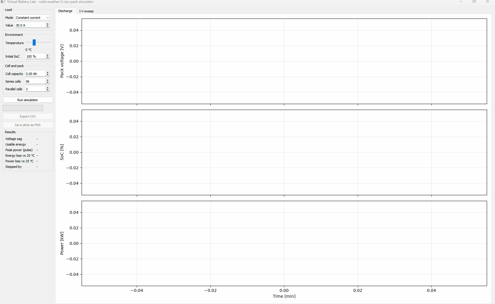
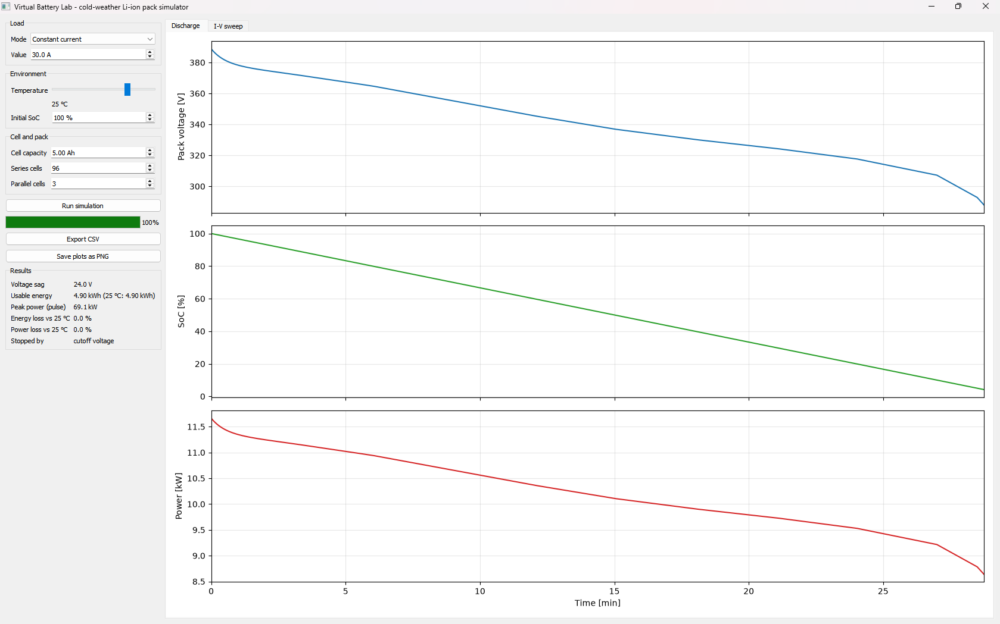
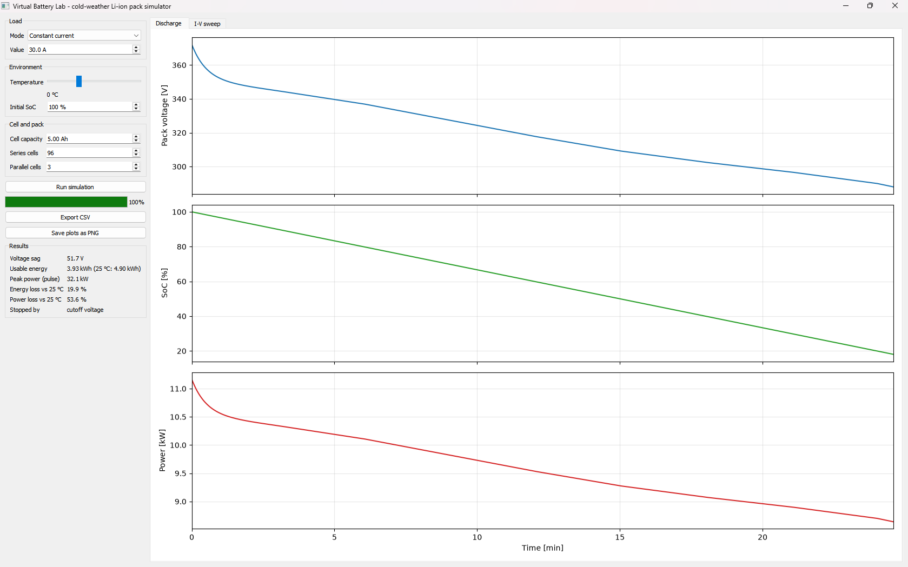
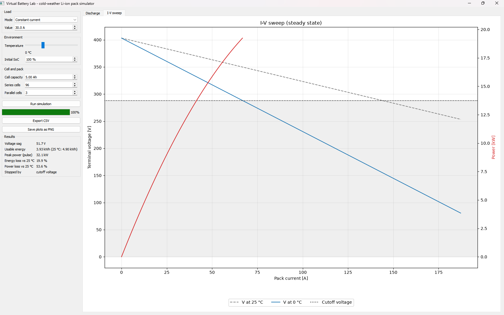

# Virtual Battery Lab

**Why does an EV lose usable range and power when the battery is cold and the load is high?**
A desktop app that lets you see it in seconds, no test bench needed.



## Problem

Cold Li-ion cells have a much higher internal resistance. Under load, the terminal
voltage sags faster, hits the cutoff voltage early, and leaves charge stranded in the pack.
Range drops and available power drops with it.

## Approach

A Python / PyQt5 simulator of a Li-ion pack with a first-order Thevenin
equivalent circuit: OCV(SoC) source, ohmic resistance R0, and one RC pair (R1, C1).

| Equation | Meaning |
|---|---|
| dz/dt = -I / (3600 Q) | State of charge (Coulomb counting) |
| dV1/dt = -V1/(R1 C1) + I/C1 | RC polarisation (exact discretisation) |
| V = OCV(z) - I R0(T) - V1 | Terminal voltage |
| R(T) = R_ref * exp[(Ea/R)(1/T - 1/T_ref)] | Arrhenius temperature factor |

Constant-power loads are solved with the quadratic R0·I² − V_eq·I + P = 0.
A power request that the pack cannot deliver stops the run with "power limit".

**Features:** live discharge plots (voltage, SoC, power), I-V sweep with the 25 °C
comparison, key results (voltage sag, usable energy, peak power, % loss vs 25 °C),
CSV and PNG export, and a simulation that runs in a `QThread` so the GUI stays responsive.

## Result

Default pack: 96s3p, 5 Ah cells (about 5 kWh), 30 A discharge, from 100% SoC.

| Temperature | Usable energy | Loss vs 25 °C |
|---|---|---|
| 25 °C | 4.90 kWh | - |
| 0 °C | 3.93 kWh | 19.9 % |
| -10 °C | 2.32 kWh | 52.7 % |
| -20 °C | 0.56 kWh | 88.5 % |

At 0 °C the voltage sag doubles (24 V to 52 V), peak pulse power drops by 54 %,
and the pack hits cutoff with about 18 % of its charge unused.





> **Two power numbers.** "Peak power (pulse)" uses R0 only (an instant load step).
> The I-V sweep shows steady-state power (R0 + R1), which stops where the voltage
> hits the cutoff. At 0 °C that is about 19 kW at 67 A.

> **Illustrative parameters.** The OCV table, R0, R1, tau and the Arrhenius
> activation temperature are typical values for a generic NMC cell, not measured data
> and not tied to any manufacturer. The *trend* is physical; the exact percentages are not.

## How to run

Requires Python 3.9 or newer.

```bash
git clone https://github.com/Pratikkute27/virtual-battery-lab.git
cd virtual-battery-lab
python -m venv .venv
.venv\Scripts\activate          # macOS/Linux: source .venv/bin/activate
pip install -r requirements.txt
python main.py
```

Run the tests with `python -m pytest -q`.

## Project structure


```
virtual-battery-lab/
├── main.py # entry point: python main.py
├── requirements.txt # numpy, matplotlib, PyQt5, pytest
├── README.md
├── conftest.py # lets pytest import the project
├── model/ # battery model, no GUI code
│ ├── parameters.py # CellParams, PackConfig (illustrative NMC values)
│ ├── cell.py # OCV, Arrhenius resistance, terminal voltage, I-V
│ ├── simulate.py # discharge loop (constant current / constant power)
│ └── metrics.py # sag, usable energy, peak power, loss vs 25 °C
├── gui/ # PyQt5 interface
│ ├── main_window.py # controls, tabs, results readout
│ ├── plot_canvas.py # embedded matplotlib plots
│ └── worker.py # QThread worker (keeps the GUI responsive)
├── export/
│ └── io_utils.py # CSV export
├── tests/ # pytest: 11 tests
│ ├── test_cell.py
│ ├── test_simulate.py
│ └── test_export.py
└── docs/ # screenshots and demo GIF
```


The `model/` package contains no GUI code, so it can be tested and reused on its own.

## Limitations

- One RC pair; no hysteresis, ageing, or thermal self-heating.
- Capacity is not derated at low temperature; the loss comes from resistance alone.
- Not validated against measured cell data.
- Discharge only.

## Author

Pratik Kute - [LinkedIn](https://www.linkedin.com/in/pratik-kute/)